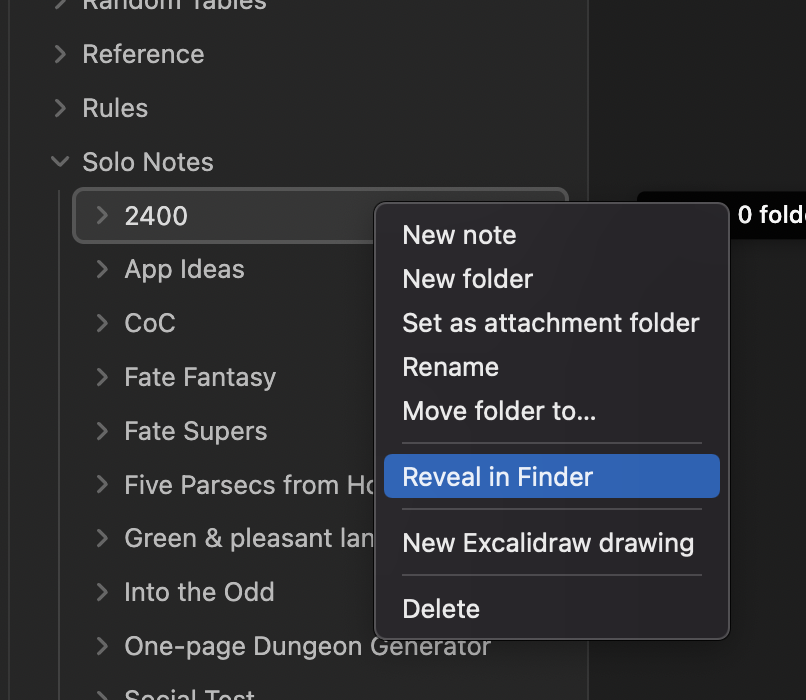
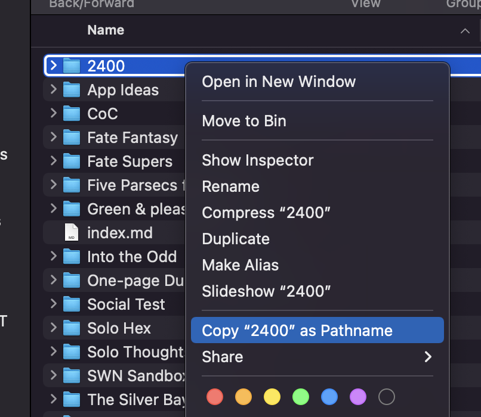
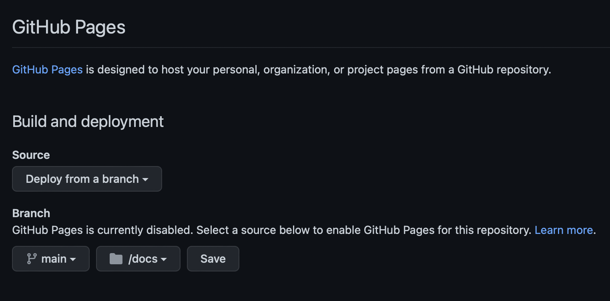

# Obsidian Github Pages Starter Repo

Please note: This page may seem long but it's really just downloading some stuff and tweaking settings. Have a read through to get a good feel for it first.

If you have any problems let me by filing a bug or contributing a change to the repo.

## Prerequisites

- Be able to setup and use Github
- Be able to run simple commands from the Command Line/Terminal
- Be familiar with `npm` optional

## Installation steps summary

You need to:

1. Have a Github Account and it set up on your machine. See https://github.com
2. Clone this repo to your machine
3. Have Obsidian-html installed locally. https://obsidian-html.github.io/Instructions/Quickstart.html
4. [Modify the the config file here to get started](#modifying-the-config).
5. [Run Obsidian-html on your Obsidian Vault](#build-your-website).
6. Push your cloned repo to your Github account.
7. [Setup your new Github repo to work with GithubPages](#setup-github-page).
8. Visit your site.
9. (Optional) [Set up with a domain name or subdomain](#domain-and-subdomains-optional).

## Modifying the config

Reference: [Obsidian-html docs for reference](https://obsidian-html.github.io/Configurations/Configuration%20Options.html#!obsidian_folder_path_str)

1. Open the `config.yml` from the root of this project.
2. Find `obsidian_folder_path_str: "/Path/to/your/Obsidian/vault"` and update to the root path to your Obsidian folder. This needs to be the root of the Vault or some links might break.

```yaml
    obsidian_entrypoint_path_str: obsidian_folder_path_str: "/Users/myname/Documents/Obsidian Vaults/Solo"
```

3. Find `obsidian_entrypoint_path_str: obsidian_folder_path_str: "/Path/to/your/Obsidian/vault/sub/folder"` and update to the subfolder you want. For me I had something like this:

```yaml
    obsidian_entrypoint_path_str: obsidian_folder_path_str: "/Users/myname/Documents/Obsidian Vaults/Solo/Solo Notes"
```

4. Note that I've set up the output folder for the generated site to be `docs`. This is for Github Pages.

5. Find `site_name: "Website Title Goes Here"` and update with your website name. Example:

```yaml
site_name: "Stories of Bardova"
```

Your config should be set up now.

6. There are other options in here you may want/need to modify. The ones I've used are for a simple Github Pages site.

[Back to Steps](#installation-steps-summary)

### Finding the path to your Obsidian Vault

If you right click on a folder you will get an option to 'Reveal in Finder' or whatever the Windows version of that is (see image below). You can use this to find the path name to your folder.



Quick way to get the path on Mac...



## Build your website

There are two ways to do this from the root of your github project:

1. If you have `npm` installed, you should be able to run `npm run build`
2. Otherwise, run `obsidianhtml convert -i config.yml`

If successful, you should see two changes to your repo. The `docs` folder should be populated with your website and there should be a `output` folder with markdown files. The `output` folder is ignored by the `.gitignore` file.

[Back to Steps](#installation-steps-summary)

## Setup GitHub Page

Reference: [GitHub Pages Setup Help](https://docs.github.com/en/pages/getting-started-with-github-pages/creating-a-github-pages-site)

1. Go to your project in Github.
2. Go to the `settings` for the project.
3. Go to `Pages` in the side panel.
4. Update this page to have the following settings:



The main thing is that you've pointed the Branch to `main` and the subfolder `docs`.

5. Save your settings.
6. Your site should now be set up to publish your website. Every time you change the contents of `docs` the site will rebuild.

[Back to Steps](#installation-steps-summary)

## Domain and Subdomains (optional)

1. Follow the [instructions here on how to set up a domain with Github Pages](https://docs.github.com/en/pages/configuring-a-custom-domain-for-your-github-pages-site/about-custom-domains-and-github-pages).
2. Once that is done you need to modify the CNAME file in the root of your project. It just needs a simple text string added with your Domain or SubDomain.

If you are using a subdomain, e.g. `ap.mywebsite.com` then that goes here.

E.g. the files should simply read:

```yaml
www.mywebsite.com
```

or

```yaml
subdomain.mywebsite.com
```

[Back to Steps](#installation-steps-summary)
